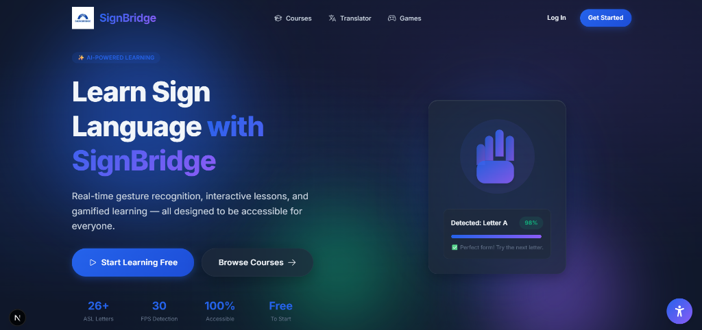
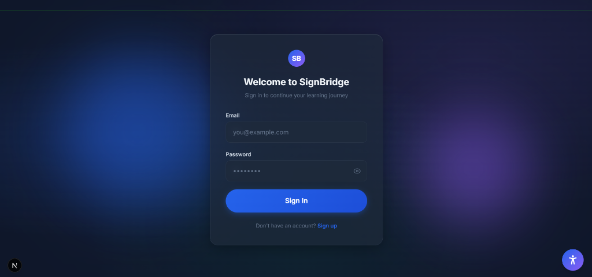
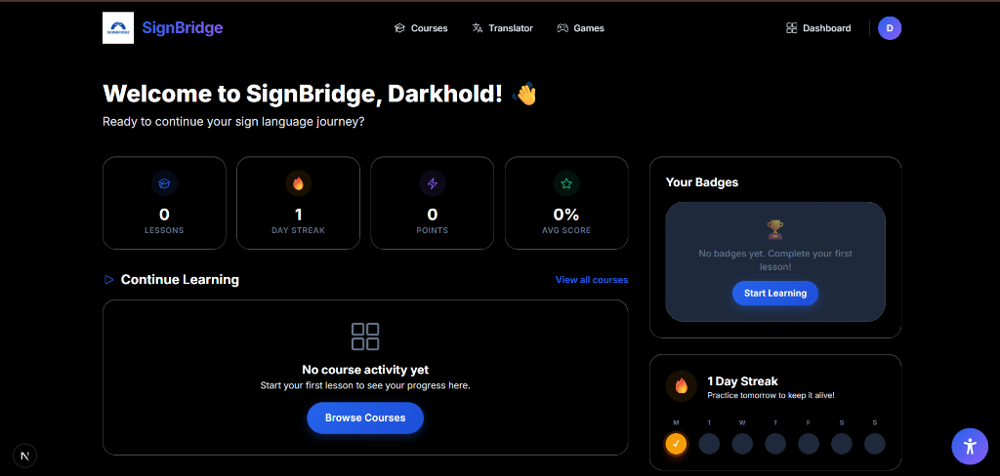
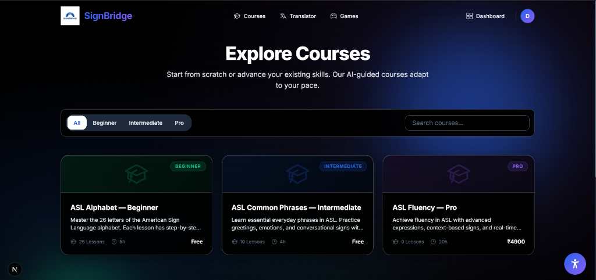
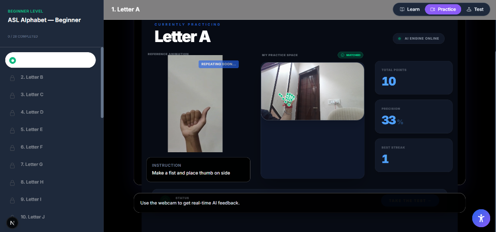
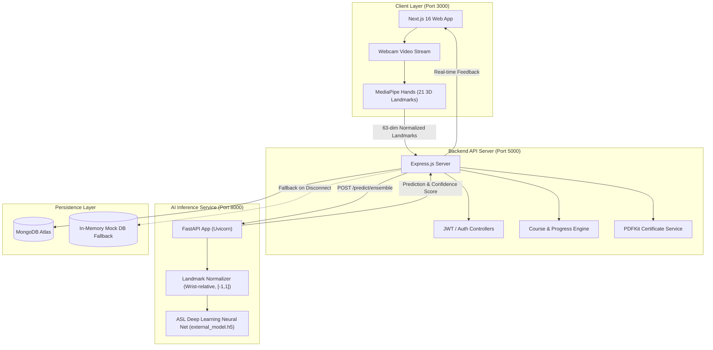

# 🤟 SignBridge (Signa)

### *AI-Powered Sign Language Learning & Real-Time Recognition Platform*

[](https://nextjs.org/)
[](https://expressjs.com/)
[](https://fastapi.tiangolo.com/)
[](https://tensorflow.org/)
[](https://developers.google.com/mediapipe)
[](https://drive.google.com/drive/folders/10zN6PqVvfh_SeQytsg9FN_bT9wVWcPuA)

---

## 📽️ Project Demonstration

> 📺 **Watch the Full Video Walkthrough and Working Demo:**  
> **Google Drive Link:** [**SignBridge Video Demonstration & Assets**](https://drive.google.com/drive/folders/10zN6PqVvfh_SeQytsg9FN_bT9wVWcPuA)

---

## 📖 Overview

**SignBridge** is a modern, accessible web platform built to bridge communication gaps for the Deaf, Hard-of-Hearing, and speech-impaired communities, as well as curious learners worldwide. Traditional methods of learning sign language are often static, fragmented, and lack immediate feedback. 

SignBridge transforms sign language education into an interactive, gamified, and real-time experience by combining:
- **Computer Vision (MediaPipe Hands)** for sub-millisecond 21-point 3D hand skeletal tracking.
- **Deep Learning Neural Networks** trained to classify American Sign Language (ASL) gestures from normalized landmark vectors.
- **Microservices Architecture** linking a reactive Next.js client, an Express.js API gateway, and a high-performance Python FastAPI inference server.
- **Built-in Offline Capability** with an in-memory mock database fallback that allows the application to run smoothly even without an active cloud database connection.

---

## 📸 Application Screenshots

### 🏠 Landing Page & Hero

*The SignBridge homepage showcases the platform's core promise — AI-powered sign language learning with real-time gesture detection at 98% accuracy. Features quick stats (26+ ASL letters, 30 FPS detection, 100% accessible, free to start) and clear CTAs to begin learning instantly.*

---

### 🔐 Authentication & User Onboarding

*Clean, glassmorphic sign-in portal with email and password authentication, password visibility toggle, and a quick sign-up link. Designed with accessibility-first principles on a sleek dark gradient background.*

---

### 📊 Student Dashboard & Progress Tracking

*Personalized student dashboard displaying key learning metrics — completed lessons, day streak (with weekly calendar tracker), XP points, and average score. Includes a badges panel, continue-learning section, and quick-access navigation to all courses.*

---

### 📚 Course Catalog & Curriculum Tiers

*Three structured learning tiers: **ASL Alphabet — Beginner** (26 lessons, 5h, Free), **ASL Common Phrases — Intermediate** (10 lessons, 4h, Free), and **ASL Fluency — Pro** (20h, ₹4900). Filter by difficulty level and search across all available courses.*

---

### 🖐️ Real-Time AI Practice & Gesture Recognition

*The heart of SignBridge — live webcam practice for Letter A with a reference animation on the left and the user's hand tracked by MediaPipe on the right (21 green landmarks visible). Shows real-time stats: total points (10), precision (33%), best streak (1), and AI engine status (online). Three learning modes available: Learn, Practice, and Test.*

---

## 🚀 Key Features

- **🖐️ Real-Time 3D Hand Tracking**:
  - Leverages MediaPipe Hands to capture 21 distinct 3D landmarks $(X, Y, Z)$ per hand at 30+ FPS directly in the browser.
- **🧠 Zero-Latency AI Model Inference**:
  - Preprocesses coordinate vectors by wrist-centering $(x_0, y_0, z_0)$ and max-absolute scaling $([-1, 1])$, passing 63-element feature vectors to a dedicated Keras neural network.
- **📚 Step-by-Step Curriculum**:
  - Lessons organized into beginner (A–Z alphabets + utilities), intermediate, and advanced levels with reference images, audio guidance, and accessibility captions.
- **📝 Automated Assessment & Instant Feedback**:
  - Real-time gesture evaluation with instant confidence percentages, progress tracking, and lesson completion validation.
- **🔤 Interactive Text-to-Sign Translation**:
  - Converts phrases and words into ordered visual gesture instructions for bi-directional communication practice.
- **🏆 Certification Engine**:
  - Generates verifiable PDF certificates with unique certificate IDs upon course completion.
- **🎮 Gamified Learning**:
  - XP points, lesson star ratings, streak milestones, and arcade practice games to boost retention.
- **🛡️ Resilient Dual-Mode Database**:
  - Automatically connects to MongoDB Atlas or falls back seamlessly to an in-memory mock store pre-seeded with beginner and intermediate curricula for instantaneous local evaluation.

---

## 🏗️ System Architecture



---

## 🔬 Recognition & Preprocessing Pipeline

```
           Webcam Input Stream
                   │
                   ▼
         MediaPipe Hands Model
                   │
                   ▼
   21 Hand Landmarks: [(x0,y0,z0), ..., (x20,y20,z20)]
                   │
                   ▼
  1. Flatten coordinates to 1D vector (length = 63)
  2. Translate origin to wrist: landmark[i] -= wrist[0]
  3. Normalize scale: vector = vector / max(|vector|)
                   │
                   ▼
      Input Vector shape: (1, 63)
                   │
                   ▼
       Deep Neural Network (Keras / TF)
  ┌─────────────────────────────────────────┐
  │ Dense(128, ReLU)                        │
  │ BatchNormalization                      │
  │ Dropout(0.3)                            │
  │ Dense(64, ReLU)                         │
  │ Dense(5, Softmax)                       │
  └─────────────────────────────────────────┘
                   │
                   ▼
     Predicted Class + Top-3 Confidence Scores
```

---

## 🛠️ Tech Stack

| Domain | Technologies & Libraries |
| :--- | :--- |
| **Frontend** | Next.js 16, React 19, Tailwind CSS 4, Framer Motion, React Icons, Axios |
| **Vision & Landmarks** | `@mediapipe/hands`, WebRTC Camera APIs, Fingerpose |
| **Backend API** | Node.js, Express 5, Mongoose, JSON Web Tokens (JWT), BcryptJS, PDFKit, QRcode |
| **AI Inference** | Python 3.12, FastAPI, Uvicorn, TensorFlow 2.19, Keras 3, NumPy, OpenCV, Scikit-learn |
| **Storage & Data** | MongoDB / MongoDB Atlas, In-Memory Seeded Database Fallback |
| **Dev Orchestration** | Node `start-dev.js` multi-process runner, Windows `start.bat` |

---

## 📁 Repository Structure

```text
SignLang-mk101/
├── ai-service/                   # Python FastAPI AI Inference Service
│   ├── models/
│   │   └── external_model.h5     # Trained ASL gesture model weights
│   ├── api.py                    # FastAPI endpoints (/predict/ensemble, /health)
│   ├── model_preprocess.py       # Exact wrist-normalization logic
│   └── requirements.txt          # Python dependencies
│
├── client/                       # Next.js 16 Frontend Application
│   ├── public/                   # Static assets & icons
│   ├── src/
│   │   ├── app/                  # App Router pages
│   │   │   ├── (dashboard)/      # Student dashboard
│   │   │   ├── courses/          # Course listing & interactive lessons
│   │   │   ├── games/            # Interactive arcade games
│   │   │   ├── translator/       # Text-to-sign translator
│   │   │   ├── certificates/     # Certificate viewer
│   │   │   ├── login/ & register/# Authentication views
│   │   │   └── page.js           # Landing page
│   │   ├── components/           # Reusable UI components
│   │   ├── contexts/             # Global Auth & State contexts
│   │   └── lib/api.js            # Axios client with JWT interceptor
│   └── package.json
│
├── server/                       # Express.js REST API Gateway
│   ├── config/db.js              # MongoDB connector with auto Mock DB fallback
│   ├── controllers/              # Course, user, progress, and assessment controllers
│   ├── middleware/               # Auth guards, validation, rate limiting
│   ├── models/                   # Mongoose schemas (User, Course, Lesson, Certificate)
│   ├── routes/                   # API endpoint routers
│   ├── seeds/autoSeed.js         # Default lesson curriculum seeder
│   ├── server.js                 # Express application entrypoint
│   └── package.json
│
├── docs/                         # Documentation & PRD
│   ├── PRD.md                    # Detailed Product Requirements Document
│   └── screenshots/              # High-resolution UI captures
│
├── start-dev.js                  # Multi-service local orchestrator (starts all 3)
├── start.bat                     # Windows one-click startup batch script
└── package.json                  # Root orchestrator package
```

---

## ⚡ Quick Start & Running the Project

### Prerequisites
- [Node.js](https://nodejs.org/) (v18 or higher recommended, tested on Node v22.14)
- [Python](https://www.python.org/) (v3.10+ recommended, tested on Python 3.12)
- Webcam (built-in or USB)

---

### Option 1: One-Command Dev Launcher (Recommended)

1. **Clone the repository:**
   ```bash
   git clone https://github.com/ironcap95/SignLang-mk101.git
   cd SignLang-mk101
   ```

2. **Install dependencies:**
   ```bash
   # Install server packages
   cd server && npm install && cd ..

   # Install client packages
   cd client && npm install && cd ..

   # Install Python dependencies
   cd ai-service && pip install -r requirements.txt && cd ..
   ```

3. **Configure Server Environment:**
   Create a `server/.env` file:
   ```env
   PORT=5000
   NODE_ENV=development
   MONGODB_URI=mongodb://localhost:27017/signa
   JWT_SECRET=signa-super-secret-jwt-key-dev-mode
   CLIENT_URL=http://localhost:3000
   AI_SERVICE_URL=http://localhost:8000
   ```
   *(Note: If you do not have a local MongoDB running, the server will automatically activate its internal mock database and seed all courses).*

4. **Launch all 3 services concurrently:**
   ```bash
   node start-dev.js
   ```
   *(Or on Windows, simply double-click `start.bat`)*

5. **Open the application:**
   - **Frontend App**: [http://localhost:3000](http://localhost:3000)
   - **API Server Health**: [http://localhost:5000/api/health](http://localhost:5000/api/health)
   - **AI Service Health**: [http://localhost:8000/health](http://localhost:8000/health)

---

### Option 2: Running Services Individually

If you prefer running each service in a separate terminal window:

#### Terminal 1 — AI Service (FastAPI)
```bash
cd ai-service
python -m uvicorn api:app --port 8000 --reload
```

#### Terminal 2 — API Server (Express.js)
```bash
cd server
npm run dev
```

#### Terminal 3 — Frontend Web App (Next.js)
```bash
cd client
npm run dev
```

---

## ⚙️ Environment Variables

### Backend (`server/.env`)
| Variable | Description | Default |
| :--- | :--- | :--- |
| `PORT` | API server listen port | `5000` |
| `NODE_ENV` | Runtime environment (`development` / `production`) | `development` |
| `MONGODB_URI` | MongoDB connection URI (triggers mock fallback if offline) | `mongodb://localhost:27017/signa` |
| `JWT_SECRET` | Secret key used for signing authentication tokens | `signa-super-secret-jwt-key` |
| `CLIENT_URL` | Allowed CORS origin for the Next.js client | `http://localhost:3000` |
| `AI_SERVICE_URL`| Address of the running FastAPI AI service | `http://localhost:8000` |

### Frontend (`client/.env.local` - Optional)
| Variable | Description | Default |
| :--- | :--- | :--- |
| `NEXT_PUBLIC_API_URL` | Express API gateway endpoint | `http://localhost:5000/api` |

---

## 🎯 Target Audience & Accessibility

- **Deaf & Hard-of-Hearing Learners**: Visual-first UI, comprehensive subtitles, interactive gesture feedback without audio reliance.
- **Educators & Sign Tutors**: Standardized assessment tools, structured progression, automated scoring.
- **Beginner Sign Learners**: Non-intimidating interactive games, real-time posture corrections, free alphabet starter tiers.
- **Children (5+)**: High-contrast friendly UI, achievement badges, and animated celebration feedback.

---

## 🔮 Future Roadmap

- [ ] **Continuous Sign Translation**: Expand from static alphabet/word recognition to continuous sentence-level recognition using temporal models (LSTM / Transformers).
- [ ] **Indian Sign Language (ISL)**: Expand dictionary support to ISL and other regional sign languages.
- [ ] **Two-Way Voice Translation**: Real-time sign-to-speech and speech-to-sign avatar synthesis.
- [ ] **Mobile Application**: Native iOS & Android companion apps utilizing on-device CoreML / TFLite.
- [ ] **Multi-Hand & Bimanual Signs**: Recognition support for complex signs requiring both hands and facial markers.

---

## 🤝 Contributing

Contributions, feedback, and issue reports are warmly welcomed!
1. Fork the Project
2. Create your Feature Branch (`git checkout -b feature/AmazingFeature`)
3. Commit your Changes (`git commit -m 'Add some AmazingFeature'`)
4. Push to the Branch (`git push origin feature/AmazingFeature`)
5. Open a Pull Request

---

## 📜 License

This project is created for educational and research purposes. Please review the repository license and third-party library licenses for reuse.

---

<div align="center">
  <sub>Bridging communication gaps through artificial intelligence & accessible design.</sub><br/>
  <b>🤟 SignBridge Team</b>
</div>
